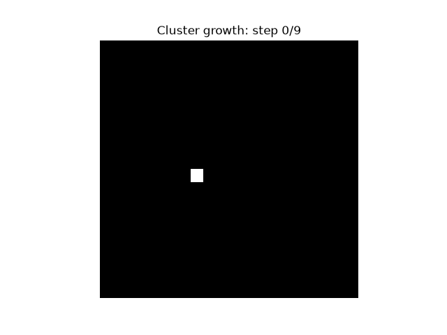
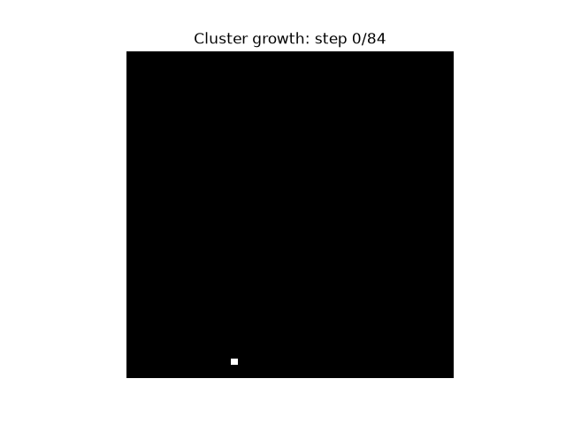
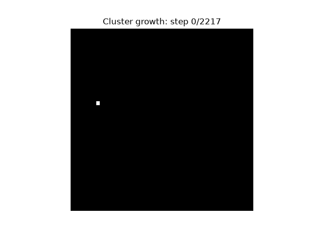
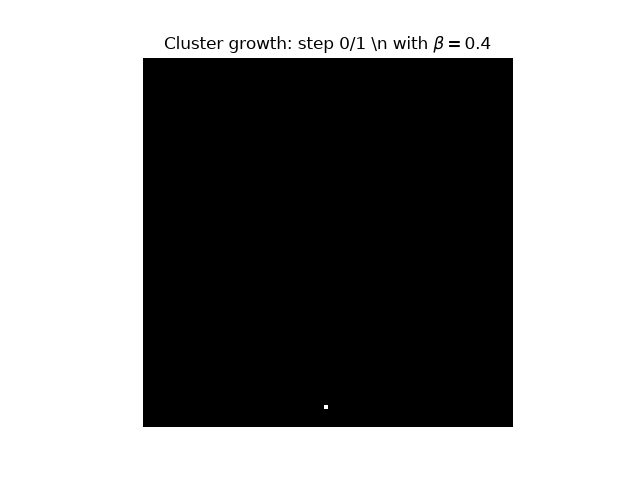
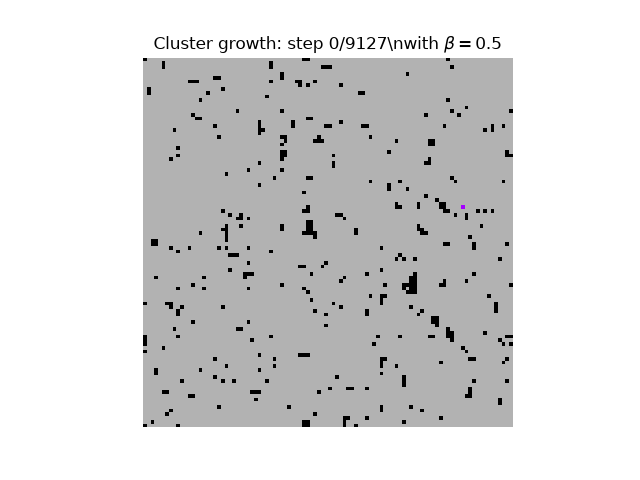
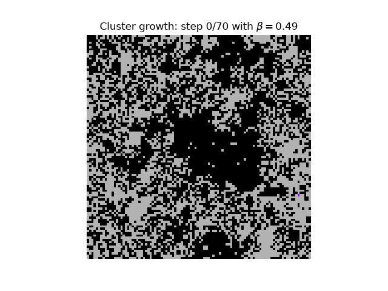
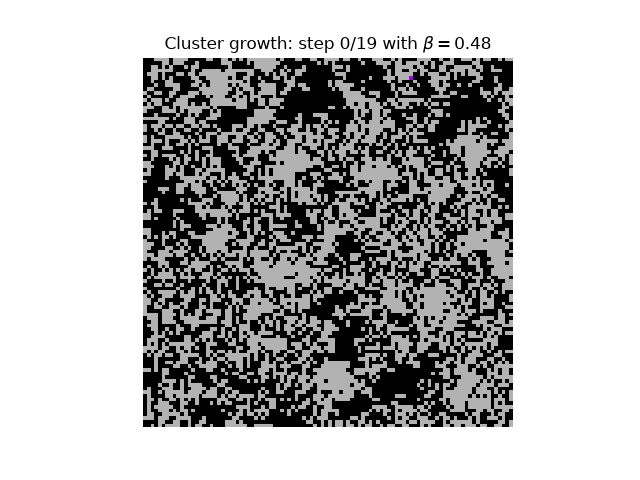

# Animations of the Wolff Algorithm

## Cluster growth 
First, we for lattice size $20\times20$ with LHS $\beta=0.40$ and RHS $\beta=0.50$
<table>
  <tr>
    <td></td>
    <td></td>
  </tr>
</table>
Next, we for lattice size $50\times50$ with LHS $\beta=0.40$ and RHS $\beta=0.50$

<table>
  <tr>
    <td></td>
    <td></td>
  </tr>
</table>
Lastly, we for lattice size $100\times100$ with LHS $\beta=0.40$ and RHS $\beta=0.50$

<table>
  <tr>
    <td></td>
    <td></td>
  </tr>
</table>
We tried $1000\times1000$ however it crashed my vscode when animating due to memory overload.

## Cluster growth over spin state

We've plotted our ising spin state with $+1$ in grey and $-1$ in black, with the cluster spreading in purple. 

In an ordered states $<T_c$

In a disordered states $<T_c$

